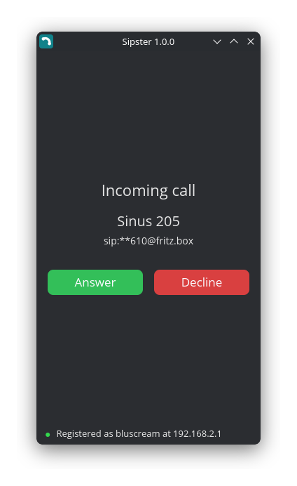
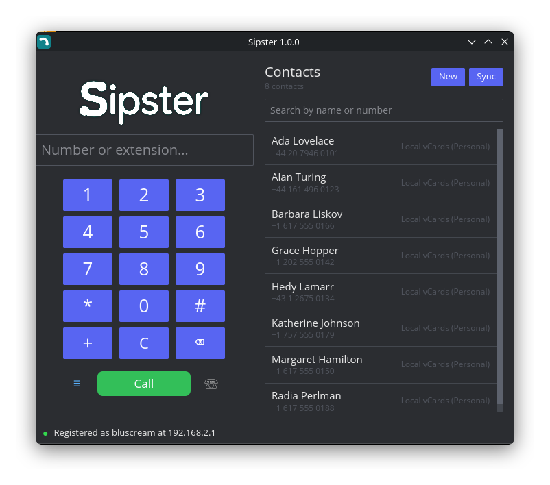

<div align="center">


# Sipster

**A lightweight, modern Rust softphone for the Linux desktop.**

Register against your Fritz!Box (or any standards-compliant SIP registrar),
place and take calls from your PC, and dial straight from the contacts and call
history your desktop already has.

[](UNLICENSE)
[](https://www.rust-lang.org)

<details>
<summary>📸 <b>Screenshots</b></summary>
<br>

| Dialer (registered) | Incoming call | Settings |
| :---: | :---: | :---: |
|  |  |  |

Contacts docked beside the dialer — the middle step of the ☰ button's cycle:



</details>

</div>

---

## What works today

This list is deliberately limited to things that demonstrably work — see
[Not yet](#not-yet) for the rest.

### Calling

- **Registration** against a SIP registrar, with re-registration.
  Tested against an AVM Fritz!Box. The status line reflects what the registrar
  actually answered, not merely that a REGISTER was sent.
- **Outgoing calls** to an extension, a phone number or a full SIP URI.
- **Incoming calls** with answer and decline, a desktop notification and a
  ringtone that rings until the call is picked up or gives up.
- **Two-way audio** through your microphone and speaker, including **early
  media** — you hear ringback, IVR prompts and announcements that arrive before
  the call is answered.
- **DTMF** to the far end while a call is up, from the dialpad or the keyboard
  — enough to drive a phone menu. Sent as RFC 4733 events.
- **Hold and resume**, offered only while there is a call to apply them to.
  Verified against a live call: the button flips only once the far end accepts,
  so it cannot claim a hold that did not happen.
- **Per-device audio selection.** Real PipeWire sinks and sources are listed
  under their own names, and switching devices re-routes a call already in
  progress. See [How device selection works](#how-device-selection-works).
- **One account per copy.** A config holds a single account, which keeps call
  state, registration and the tray icon unambiguous. To run a second line, run
  a second copy with `--config` and its own `XDG_RUNTIME_DIR`; it gets its own
  window and its own tray icon.
- **UDP, TCP or TLS** to the registrar. UDP and TCP are verified
  against a FRITZ!Box; TLS addresses the registrar as `sips:` on port 5061 but
  is untested — see below.
- **Call blocking**, with a per-number action and a default for new rules.

### Contacts and call history

- **Six sources**, synced concurrently and streamed into the list as each one
  answers rather than all at once behind the slowest:

  | Source | Needs |
  | ------ | ----- |
  | FRITZ!Box phonebook and call list | router address and admin login; over TLS by default, certificate pinned on first use |
  | Evolution Data Server | a GNOME desktop; picks up any Google/CardDAV account already added there |
  | KDE Akonadi | a file-backed address book (`vcarddir` or `contacts` resource) |
  | Local vCard folder | a directory of `.vcf` files — the vdirsyncer/khard/Radicale convention |
  | Google Contacts | your own OAuth client credentials |
  | CardDAV | server URL and login |

- **Local call history**, recorded for calls placed and received in Sipster
  itself, merged with whatever the router reports.
- **Search and filtering**, including a Blocked filter, with history in true
  date order.

### The window

- **Docking.** The contacts (☰) and history (☏) buttons cycle through three
  placements: hidden → beside the dialer → its own window → hidden. The button
  tints to show where the list went.
- **Streaming mode** masks every name and number on screen — first character,
  ellipsis, last character — for screen sharing and recording.
- **System tray** icon (StatusNotifierItem), with answer/hang-up entries that
  appear only when they apply. This is what KDE Plasma 6 on Wayland actually
  listens for. Optionally, closing the dialer leaves Sipster running there.
- **Settings window** with a category index down the side, opened from the
  wordmark, the ⚙ button, `Ctrl+P`, or automatically on first run. Everything
  is editable **while the app runs** — theme, devices and sounds take effect on
  the spot, an account change re-registers without a restart, and each change
  is written to `sipster.toml` as you make it. Secret fields have an in-field
  reveal toggle.
- **Keyboard**: `Ctrl+P` settings, `Ctrl+K` contacts, `Ctrl+H` history.

### Plumbing

- **Single instance**, enforced by a kernel file lock. A second launch hands
  its request to the copy already running instead of fighting it for SIP
  port 5060.
- **Remote control and URI handling.** `sipster sipster://call/611`, a `tel:`
  link clicked in a browser, and a shell script all take the same path.
- **AppImage** packaging for x86-64 Linux, plus plain binaries for Linux
  aarch64/i686/armv7 and Windows x86-64/x86/ARM64.

### Not yet

Named here so nobody has to discover them the hard way:

- **Transfer does not work.** The UI and the plumbing are there —
  `sipster://transfer/<target>` and a button during a call — but no transfer
  has ever completed. Against a FRITZ!Box the REFER was first refused with
  429 "Provide Referrer Identity"; adding the RFC 3892 `Referred-By` header
  cleared that, and it now fails inside rvoip's state machine before reaching
  the wire. The target never rings. Attended transfer does not exist at all.
- **No Akonadi SQL store.** Akonadi address books backed by its own database —
  what an IMAP or Kolab resource writes into — are reachable only through the
  Akonadi protocol, which is a binary protocol of its own with no Rust client,
  so they are not read. The `vcarddir` and `contacts` resources, which are what
  a KDE user normally configures, are file-backed and *are* read.

What has and has not been tested: calls, per-device audio routing on both
ends, hold, resume and DTMF are verified against live calls between three
instances registered to a FRITZ!Box. Transfer is not — see above. TLS
registration is implemented but unverified, because the FRITZ!Box tested
against does not serve SIP-TLS; UDP and TCP are both verified. The
Windows-on-ARM binary cross-compiles but has never been run, there being no
ARM Windows machine here.

## Install

Grab `sipster-linux-x86_64.AppImage` from
[Releases](https://github.com/Bluscream/sipster/releases), make it executable
and run it:

```bash
chmod +x sipster-linux-x86_64.AppImage && ./sipster-linux-x86_64.AppImage
```

Other architectures and Windows builds are attached to the same release as
plain binaries, named `sipster-{os}-{arch}`.

### Runtime requirements

Sipster links exactly one non-system library, ALSA, and dlopens the graphics
stack your desktop already provides:

```console
$ ldd sipster-linux-x86_64
    libasound.so.2      # audio, via cpal — PipeWire's ALSA layer serves this
    libc.so.6  libm.so.6  libgcc_s.so.1
```

Opus is statically linked, so there is nothing else to install. These optional
programs are used when present and skipped when not:

| Program | Used for |
| ------- | -------- |
| `pw-play` / `paplay` | ringtone and call chimes |
| `notify-send` | incoming-call notifications |
| `pw-dump` / `pw-metadata` | naming and selecting PipeWire audio devices |

## Configure

There is nothing to set up by hand. On first run Sipster opens its settings
window; fill in the account and press **Apply & reconnect**.

The config file is the only source of configuration — Sipster reads no
environment variables of its own. It lives at
`$XDG_CONFIG_HOME/sipster/sipster.toml`, or wherever `--config-file` points,
and the settings window rewrites it as you make changes. It is written `0600`,
because it holds the account password in the clear (SIP digest auth needs it),
along with any router or provider credentials you enter.

The account fields mirror the Fritz!Box "telephony device" dialog, so you can
copy values across without translating them. In particular, **Username** is the
*Benutzername* on the device's *Anmeldedaten* tab — not the internal number
(620) and not your router's admin login.

```bash
sipster --config-file ~/work-phone.toml   # a second account, side by side
```

Each config is its own instance, with its own control socket, window and tray
icon — no other flags or environment variables are involved.

<details>
<summary><b>What the file looks like</b></summary>

Everything below is written and read by the settings window; you only need this
if you would rather edit it directly or deploy it from a script.

```toml
[account]
registrar = "fritz.box"    # host, host:port, or a full sip:/sips: URI
port      = 5060
username  = "bluscream"
auth_user = ""             # defaults to username
password  = "…"
transport = "udp"          # udp, tcp or tls
enabled   = true           # register this account at all
expires   = 600            # re-registration interval, seconds
local_port = 5060          # falls back to an ephemeral port if taken

[ui]
theme = "dark"          # dark, light, dracula, nord, solarized-dark,
                        # gruvbox-dark, catppuccin-mocha, tokyo-night
ringtone = true
notifications = true
dtmf_feedback = true    # local beep only; not sent to the peer
call_chimes = true
show_banner = true
register_uri_schemes = true   # handle tel:/sip:/sips:/callto:/sipster: links
close_to_tray = true          # closing the dialer leaves it in the tray
streaming_mode = false        # mask names and numbers on screen

[audio]
input  = "…"            # omit for the system default
output = "…"            # "pw:<node.name>" for a PipeWire device,
                        # or an ALSA PCM name

[integration]
local_history_enabled = true
eds_enabled  = true     # Evolution Data Server, where available
vdir_enabled = true     # local vCard folder
vdir_path    = "…"      # omit to search the usual places, Akonadi included
google_accounts  = []
carddav_accounts = []
blocked_numbers  = []
default_block_action = "reject"

[integration.fritzbox]
enabled  = true
host     = "fritz.box"
port     = 49000        # TR-064, not the SIP port; 49443 is used when tls = true
tls      = true         # certificate pinned on first use, see cert_fingerprint
username = "…"          # a router admin login, not the SIP account
password = "…"

[ipc]
socket = "…"            # omit to derive one from this config's path

[log]
file   = "…"            # omit for console only; the console is always used
filter = "info,sipster_core=debug"   # the syntax RUST_LOG used to take
```

A config written for an older version, with one or more `[[accounts]]` tables,
still loads: the first is adopted and any others are named in a warning. Saving
rewrites the file in the `[account]` form. To keep a second account, copy the
config, leave one account in each, and run a second copy with `--config`.

</details>

## Use

Sipster runs one instance per config, so running it again doubles as a remote
control: the request is handed to the copy already running. Every action is a
URI, and a URI works whether or not your desktop has registered the handler —
so there is one way to do this, not two.

```bash
sipster                            # start, or bring the running window back
sipster sipster://call/**610       # dial from a script or a hotkey
sipster sipster://dial/**610       # pre-fill the dial box without calling
sipster tel:+4930123456            # what a tel: link from your browser does
sipster sipster://answer           # answer the ringing call
sipster sipster://hangup           # hang up, or decline
sipster sipster://hold             # also: resume
sipster sipster://transfer/**623
sipster sipster://dtmf/5
sipster sipster://settings         # also: contacts, history
sipster sipster://show             # raise and focus the window
sipster sipster://quit
```

The only flags are `--config-file <path>`, `--help` and `--version`. To address
a particular copy, pass its config alongside the URI:

```bash
sipster --config-file ~/work-phone.toml sipster://hangup
```

Sipster reads no environment variables of its own — not even `RUST_LOG`.
Logging lives under `[log]` in the config file. It does honour the platform
conventions that tell any Linux program where to put things: `XDG_CONFIG_HOME`,
`XDG_RUNTIME_DIR` and `HOME`.

Register Sipster as your desktop's handler for `tel:`, `sip:` and `callto:`
links by turning on **Register URI schemes** in Settings, or by installing
`packaging/sipster.desktop` into `~/.local/share/applications/` yourself.

For detail while debugging, set the filter in the config; the file is written
in addition to the console, never instead of it:

```toml
[log]
file   = "/tmp/sipster.log"
filter = "info,sipster_core=trace"
```

## How device selection works

Worth knowing, because it explains a limitation you may otherwise trip over.

ALSA publishes exactly one PipeWire PCM — `pipewire` — and nothing per device,
and cpal enumerates that same list. Through that path "which microphone" can
only ever be answered "the default one". So Sipster reads the real device list
from `pw-dump`, opens the server's default PCM, and then moves the resulting
stream onto your chosen device with `target.object` — the same mechanism a
desktop volume mixer uses to drag a stream between outputs.

This deliberately avoids the native `pipewire` crate, which would need
libpipewire headers and clang at build time and so could not be cross-compiled
to the Windows and armv7 targets. Without PipeWire, the ALSA device list is
offered instead, exactly as before.

## Known Wayland limitations

Two behaviours that look like bugs but are the protocol:

- **Docking does not resize the window.** `window::resize` reaches the
  compositor — the window really does change size — but iced goes on laying out
  at the old width, and the result is stretched. So a docked pane fits the
  width the window already has: side by side once there is room, and in place of
  the dialpad until then. Widen the window by hand to switch between them.
- **A minimized window cannot restore itself.** `xdg_toplevel` has a
  `set_minimized` request and no matching unset, so no application can un-minimize
  itself, and it cannot even detect the state. Sipster asks for focus, checks
  whether it landed, and rebuilds the window if it did not — which is why the
  tray reliably brings the dialer back.

## Architecture

A Cargo workspace with the telephony engine kept strictly separate from the
GUI, so another frontend can reuse all of it:

| Crate | Role |
| ----- | ---- |
| [`sipster-core`](crates/sipster-core) | Headless engine: SIP signalling, SDP, RTP media, codecs and audio I/O, the call state machine, config, single-instance IPC. Provider-agnostic — no Fritz!Box specifics. |
| [`sipster-integrations`](crates/sipster-integrations) | Contact and call-history providers: FRITZ!Box TR-064, Evolution Data Server, Akonadi, vCard directories, Google People, CardDAV, and the local store. One shared vCard parser behind all of them. |
| [`sipster-ui`](crates/sipster-ui) | The desktop skin: [Iced](https://github.com/iced-rs/iced) GUI, system tray, local feedback sounds. Contains no telephony logic. |
| [`sipster-tests`](crates/sipster-tests) | Integration and end-to-end tests. |

The SIP/SDP/RTP stack and codecs come from
[rvoip](https://github.com/eisenzopf/rvoip), pinned to a git revision. Opus is
offered first for quality, with G.711 (PCMA/PCMU) as the fallback every PBX —
the Fritz!Box included — accepts.

## Build

Builds run inside the `build-box` distrobox, which carries the cross toolchains,
`alsa`/pkg-config and the `cmake` that libopus needs. `scripts/build.sh`
re-enters it for you, so run it from the host:

```bash
./scripts/build.sh check           # clippy (warnings denied) + tests
./scripts/build.sh x86_64-linux    # one target
./scripts/build.sh appimage        # dist/sipster-linux-x86_64.AppImage
./scripts/build.sh windows         # x86-64, x86 and ARM64
./scripts/build.sh all             # every target, plus the AppImage
./scripts/build.sh run             # run the AppImage without FUSE-mounting it
```

Artifacts land in `dist/` named `sipster-{os}-{arch}.{ext}`.

Note that `check` only covers the host target. It will not catch a Linux-only
call reaching cross-platform code — run `./scripts/build.sh windows` before
tagging.

While a game is running the build drops to half the cores at `nice 10` rather
than fighting it for the CPU; `SIPSTER_IGNORE_GAMES=1` uses the whole machine.

Test the AppImage with `build.sh run`, never by executing `dist/*.AppImage`
directly: a killed AppImage orphans its `/tmp/.mount_*` FUSE mount, and these
accumulate. `run` extracts instead of mounting, and `build.sh clean` clears
whatever a killed run did leave behind.

## Contributing

Two rules matter more than the rest:

1. **No unearned claims.** Nothing goes in this README, a commit message or a
   doc comment unless it has been run and observed. "Should work" is not a
   claim; limitations get named rather than omitted.
2. **The engine stays UI-agnostic.** Telephony logic belongs in
   `sipster-core`, provider logic in `sipster-integrations`, and `sipster-ui`
   is presentation only.

`./scripts/build.sh check` must pass — clippy runs with warnings denied.

## License

Dedicated to the public domain under [UNLICENSE](UNLICENSE).
