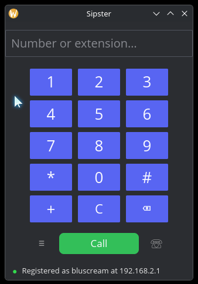
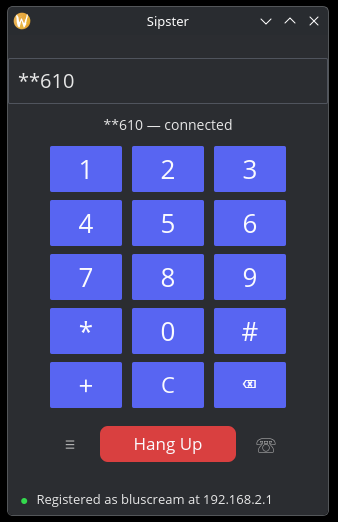
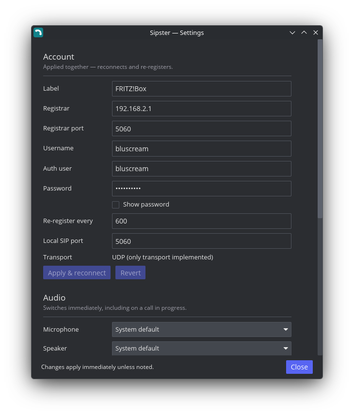

<div align="center">


# Sipster

**A lightweight, modern Rust softphone for the Linux desktop.**

Register against your Fritz!Box (or any standards-compliant SIP registrar),
place and take calls from your PC.

[](UNLICENSE)
[](https://www.rust-lang.org)


&nbsp;

&nbsp;


</div>

---

## What works today

Sipster is a young project. This list is deliberately limited to things that
demonstrably work — see [Not yet](#not-yet) for the rest.

- **Registration** against a SIP registrar over UDP, with re-registration.
  Tested against an AVM Fritz!Box.
- **Outgoing calls** to an extension, a phone number or a full SIP URI.
- **Incoming calls** with answer and decline, a desktop notification and a
  ringtone that rings until the call is picked up or gives up.
- **Two-way audio** through your normal microphone and speaker
  (PipeWire/ALSA), including **early media** — you hear ringback, IVR prompts
  and announcements that arrive before the call is answered.
- **System tray** icon (StatusNotifierItem), with answer/hang-up entries that
  appear only when they apply. This is what KDE Plasma 6 on Wayland actually
  listens for.
- **Single instance**, enforced by a kernel file lock. A second launch hands
  its request to the copy already running instead of fighting it for SIP
  port 5060.
- **Remote control and URI handling.** `sipster --call 611`, a `tel:` link
  clicked in a browser, and a shell script all take the same path.
- **Settings window**, opened from the wordmark or the ⚙ button. Account,
  audio devices, theme and sound preferences are all editable **while the app
  runs** — theme, device and sound changes take effect on the spot, and an
  account change re-registers without a restart. Everything is written to
  `sipster.toml` as you change it.
- **AppImage** packaging for x86-64 Linux, plus plain binaries for Linux
  aarch64/i686/armv7 and Windows x86-64/x86.

### Not yet

Named here so nobody has to discover them the hard way:

- **No DTMF during a call.** The dialpad plays a local feedback tone and edits
  the number field. It does not send RFC 4733 or in-band digits to the peer, so
  it cannot drive a phone menu mid-call.
- **No hold or transfer.**
- **No contact or call-list sync.** The ☏ button is a placeholder. Sync from
  the Fritz!Box phonebook and call history (TR-064), Google Contacts, KDE and
  Home Assistant is the next major goal.
- **UDP only.** The config format reserves a `transport` field, but TCP and TLS
  are not implemented.
- **No Windows-on-ARM build.** `aarch64-pc-windows-msvc` does not currently
  cross-compile here — `ring` fails under cargo-xwin. See the note in
  `scripts/build.sh`.

## Install

Grab `sipster-linux-x86_64.AppImage` from
[Releases](https://github.com/Bluscream/sipster/releases), make it executable
and run it:

```bash
chmod +x sipster-linux-x86_64.AppImage && ./sipster-linux-x86_64.AppImage
```

Other architectures and Windows builds are attached to the same release as
plain binaries, named `sipster-{os}-{arch}`.

### Runtime requirements

Sipster links exactly one non-system library, ALSA, and dlopens the graphics
stack your desktop already provides:

```console
$ ldd sipster-linux-x86_64
    libasound.so.2      # audio, via cpal — PipeWire's ALSA layer serves this
    libc.so.6  libm.so.6  libgcc_s.so.1
```

Opus is statically linked, so there is nothing else to install. `pw-play` (or
`paplay`) and `notify-send` are used for ringtones and notifications when
present, and are skipped when they are not.

## Configure

Most people will not need this section: open **Settings** from the window and
edit everything there.

Underneath, Sipster reads `$XDG_CONFIG_HOME/sipster/sipster.toml` — or whatever
`--config-file` points at. Environment variables are only a fallback, used when
that file has no account, so a first run works with nothing but the environment
and every later run reads the file. Settings shows which of the two the running
account came from. The file is written `0600`, because it holds the password.

```bash
sipster --config-file ~/work-phone.toml   # a second account, side by side
```

Pair it with `--socket` and `--no-single-instance` to run two independently
configured instances at once.

The names mirror the Fritz!Box "telephony device" dialog, so you can copy the
values across without translating them. In particular, `SIPSTER_USERNAME` is
the **Benutzername** on the device's *Anmeldedaten* tab — not the internal
number (620) and not your router's admin login.

<details>
<summary><b>Environment variables</b> (every <code>SIPSTER_</code> name also works with the shorter <code>SIP_</code> prefix)</summary>

| Variable              | Required | Default   | Meaning                                    |
| --------------------- | :------: | --------- | ------------------------------------------ |
| `SIPSTER_REGISTRAR`   |    yes   | —         | `fritz.box`, a LAN IP, or a provider domain |
| `SIPSTER_USERNAME`    |    yes   | —         | SIP username registered on the PBX          |
| `SIPSTER_PASSWORD`    |          | empty     | Account password                            |
| `SIPSTER_AUTH_USER`   |          | username  | Auth user, when it differs from the username |
| `SIPSTER_PORT`        |          | `5060`    | Registrar port                              |
| `SIPSTER_LOCAL_PORT`  |          | `5060`    | Local SIP port; falls back to an ephemeral one if taken |
| `SIPSTER_EXPIRES`     |          | `600`     | Re-registration interval, seconds           |
| `SIPSTER_LABEL`       |          | `env`     | Friendly name shown in the UI               |
| `SIPSTER_IPC_SOCKET`  |          | `$XDG_RUNTIME_DIR/sipster.sock` | Control socket path     |
| `SIPSTER_CONFIG`      |          | `$XDG_CONFIG_HOME/sipster/sipster.toml` | Config file (same as `--config-file`) |

These exist for first run and for scripted deployments. Once you have saved
anything in Settings the config file supersedes them, and you can drop them.

</details>

<details>
<summary><b>Config file</b> — <code>$XDG_CONFIG_HOME/sipster/sipster.toml</code></summary>

```toml
[[accounts]]
label     = "Fritz!Box"
registrar = "fritz.box"
port      = 5060
username  = "bluscream"
password  = "…"
expires   = 600
```

Only the first account is used today. The `[ui]` and `[audio]` tables are
written by the settings window:

```toml
[ui]
theme = "dark"          # dark, light, dracula, nord, solarized-dark,
                        # gruvbox-dark, catppuccin-mocha, tokyo-night
ringtone = true
notifications = true
dtmf_feedback = true    # local beep only; not sent to the peer
call_chimes = true
show_banner = true

[audio]
input = "…"             # omit for the system default
output = "…"
```

</details>

## Use

Sipster runs as a single instance, so its flags double as a remote control: run
it again with a flag and the request is handed to the copy already running.

```bash
sipster                      # start, or focus the running window
sipster --call '**610'       # dial from a script or a hotkey
sipster tel:+4930123456      # what a tel: link from your browser does
sipster --answer             # answer the ringing call
sipster --hangup             # hang up, or decline
sipster --quit
sipster --help

sipster --config-file ~/other.toml   # use a different config
sipster --log-file /tmp/sipster.log  # log to a file instead of stderr
```

Register Sipster as your desktop's handler for `tel:`, `sip:` and `callto:`
links by installing `packaging/sipster.desktop` into
`~/.local/share/applications/`.

Click the **Sipster** wordmark, or the ⚙ button, to open Settings.

Set `RUST_LOG` for detail, e.g. `RUST_LOG=sipster_core=trace`, and
`--log-file <path>` to send logs to a file instead of stderr.

## Architecture

A Cargo workspace with the telephony engine kept strictly separate from the
GUI, so another frontend can reuse all of it:

| Crate | Role |
| ----- | ---- |
| [`sipster-core`](crates/sipster-core) | Headless engine: SIP signalling, SDP, RTP media, codecs and audio I/O, the call state machine, config, single-instance IPC. Provider-agnostic — no Fritz!Box specifics. |
| [`sipster-ui`](crates/sipster-ui) | The desktop skin: [Iced](https://github.com/iced-rs/iced) GUI, system tray, local feedback sounds. Contains no telephony logic. |
| [`sipster-tests`](crates/sipster-tests) | Integration and end-to-end tests. |

The SIP/SDP/RTP stack and codecs come from
[rvoip](https://github.com/eisenzopf/rvoip), pinned to a git revision. Opus is
offered first for quality, with G.711 (PCMA/PCMU) as the fallback every PBX —
the Fritz!Box included — accepts.

## Build

Builds run inside the `build-box` distrobox, which carries the cross toolchains,
`alsa`/pkg-config and the `cmake` that libopus needs. `scripts/build.sh`
re-enters it for you, so run it from the host:

```bash
./scripts/build.sh check           # clippy (warnings denied) + tests
./scripts/build.sh x86_64-linux    # one target
./scripts/build.sh appimage        # dist/sipster-linux-x86_64.AppImage
./scripts/build.sh all             # every target, plus the AppImage
```

Artifacts land in `dist/` named `sipster-{os}-{arch}.{ext}`.

To try registration without the GUI:

```bash
./scripts/register-test.sh          # prompts; the password is never echoed
./scripts/register-test.sh '**9'    # register, then dial
```

## Contributing

[`AGENTS.md`](AGENTS.md) documents the project's rules — the workspace layout,
the pure-Rust boundary and, most importantly, the no-unearned-claims rule that
this README is written under. Read it before opening a PR.

## License

Dedicated to the public domain under [UNLICENSE](UNLICENSE).
